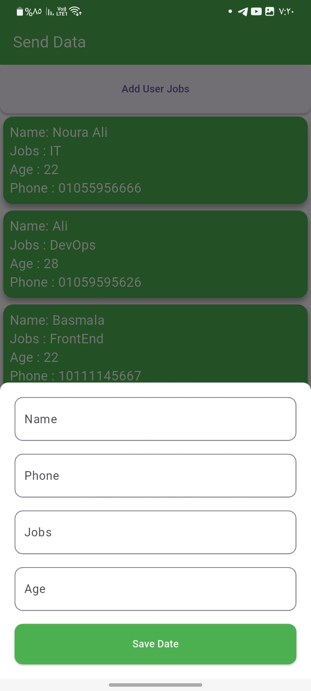

# ✅ Send Data App - Flutter & Firebase

A smart and elegant app built with **Flutter** and **Firebase Firestore** that allows you to **add**, **view**, and **delete user information** (Name, Phone, Jobs, Age) with a clean interface and real-time database updates.


---

## ✨ Features

- ➕ Add new users (Name, Phone, Job, Age)
- 🗑️ Delete user by swiping using `flutter_slidable`
- 🔄 Real-time updates using Firebase Firestore
- 📋 Live list of users displayed instantly
- 🎨 Clean and responsive UI
- 🧼 Validations for all form fields

---

## 📱 Supported Platforms

| Platform | Support |
|----------|---------|
| Android  | ✅ Fully Supported |
| iOS      | ✅ Fully Supported |
| Web      | ✅ Fully Supported |
---

## 🖼️ Screenshots

<p float="left">
  
  
  
</p>

---

## 🛠️ Tech Stack

- **Framework:** Flutter 3.0+
- **Language:** Dart
- **Database:** Firebase Firestore
- **UI Packages:**
    - [`flutter_slidable`](https://pub.dev/packages/flutter_slidable) for swipe-to-delete
- **State Management:** setState
- **Validation:** Form + TextFormField
- **Date Handling:** N/A (can be added)

---

## 🚀 Getting Started

### Prerequisites

- Flutter SDK (3.0 or newer)
- Firebase Project with Firestore enabled
- Android Studio / VS Code
- A connected device or emulator

### Setup Instructions

1. **Clone the repo:**
```bash
   git clone https://github.com/your-username/send_data_app.git
   cd send_data_app
```


## 📄 License

- This project is open source and free to use for personal or educational purposes.